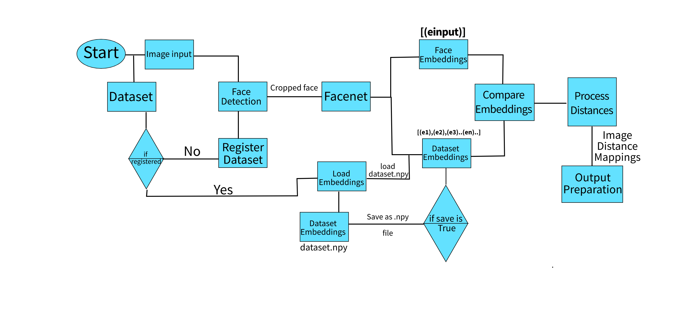

# Face Recognition on CelebA dataset

In this project, we are dealing with an interesting problem. In this problem, we are trying to figure out the **similer faces** present in the dataset given an **image as an input** to the system.

# Approach

The proposed solution consists of various stages.

 1. Detection of a face
 2. Feature extraction
 3. Classification of a face

# Project workflow
The workflow is as follows:
  

 

## Project Structure
Following is the project structure
		
	face-recognition

	├─ LICENSE
	├─ classification
	│ └─ facenet
	│ └─ inception_resnet_v1.py
	├─ config.py
	├─ configs
	│ └─ cfg.ini
	├─ datasets
	│ ├─ create_dataset.py
	│ ├─ facenet
	│ │ └─ CelebA_embeddings.npy
	│ ├─ mtcnn
	│ │ └─ CelebA.npy
	│ └─ test_images
	│ ├─ 096418.jpg
	│ ├─ 1
	│ │ ├─ 000023.jpg
	│ │ ├─ 004506.jpg
	│ │ ├─ 006439.jpg
	│ │ ├─ 014042.jpg
	│ │ └─ 033490.jpg
	│ ├─ 13
	│ │ └─ 096418.jpg
	│ ├─ 181
	│ │ └─ 152422.jpg
	│ ├─ 184
	│ │ └─ 085767.jpg
	│ ├─ 266
	│ │ └─ 111749.jpg
	│ ├─ 26
	│ │ └─ 088434.jpg
	│ └─ 273
	│ └─ 045871.jpg
	├─ detection
	│ └─ mtcnn.py
	├─ main.py
	├─ utils
	│ ├─ detect_face.py
	│ ├─ download.py
	│ ├─ general.py
	│ ├─ tensorflow2pytorch.py
	│ └─ training.py
	└─ weights
		├─ facenet
		│ ├─ 20180402-114759-vggface2.pt
		│ └─ customfaceCelebA1.pt
		└─ mtcnn
		  ├─ onet.pt
		  ├─ pnet.pt
		  └─ rnet.pt

## Installation

For installation, follow the instructions below

 - Clone the repository
 - Head into cloned directory `cd <path/to/cloned/dir>`
 - Install dependencies using `requirements.txt` file. Run `pip install -r requirements.txt`
 
## Configuration

The project contain a **config file** which will help in changing different core settings of the project like 'input and output directories' used for uploading and downloading data.

To change settings, change `configs/cfg.ini`

## Running face-match

To run the project
run, 

    python main.py 

**Note:** You might want to change the datasets and face paths inside main.py. file.

## Dataset Preparation

This section is specific to problem set only. The dataset preparation is an important step for training face recognition model.

Typically CelebA dataset consists of:

 1. CelebA image data - This consists of all the images
 2. Identity image to class - text file consists of class for each image.
 
 To train the classifier, we neeed data in following format
 
    dataset for training
   
	├─ dataset
	│ ├─ CelebA
	│ |  ├─ 1
	│ │ ├─ 000023.jpg
	│ │ ├─ 004506.jpg
	│ │ ├─ ...
	│ ├─ 13
	│ │ └─ 096418.jpg
	│ │ ├─ 002346.jpg
	│ │ ├─ ...
	│ ├─ 181
	│ │ └─ 152422.jpg
	│ │ ├─ 045646.jpg
	│ │ ├─ ...
	│ ├─ 184
	│ │ └─ 085767.jpg
	│ │ ├─ 122336.jpg
	│ │ ├─ ...
	│ ├─ 266
	│ │ └─ 111749.jpg
	| |.├─ 122336.jpg
	│ │ ├─ ...

## Training
To train the custom facenet model,
Run,

    python main.py train -d path/to/dataset
   
For changing training configurations, edit **cfg.ini** under **configs/**

## Contact
**Email:** anurag.vishwakarma9@gmail.com
**LinkedIn:** https://www.linkedin.com/in/anuragvishu/
